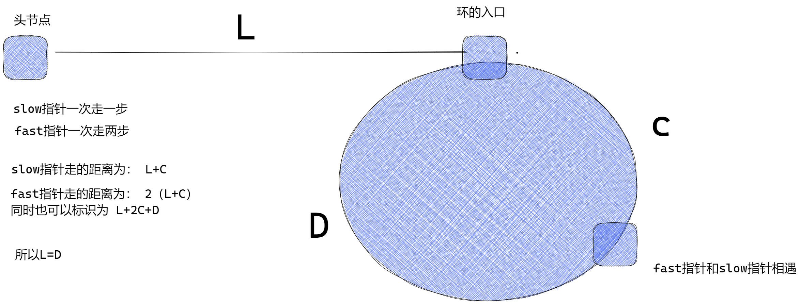
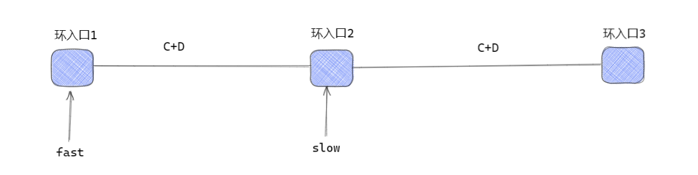
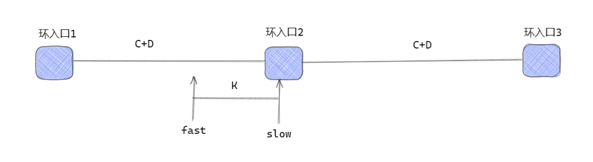

## 题目地址(142. 环形链表 II)

[https://leetcode-cn.com/problems/linked-list-cycle-ii/](https://leetcode-cn.com/problems/linked-list-cycle-ii/)

## 思路1：哈希表

我们遍历链表中的每个节点，并将它记录下来；一旦遇到了此前遍历过的节点，就可以判定链表中存在环。


## 代码

- 语言支持：Java

Java Code:

```java
public class Solution {
    public ListNode detectCycle(ListNode head) {
        ListNode pos = head;
        Set<ListNode> visited = new HashSet<ListNode>();
        while (pos != null) {
            //如果遇到以前遍历过的节点
            if (visited.contains(pos)) {
                return pos;
                //如果没有遇到过，就添加
            } else {
                visited.add(pos);
            }
            //往下走
            pos = pos.next;
        }
        return null;
    }
}

```

**复杂度分析**

令 n 为链表长度。

- 时间复杂度：$O(n)$，最坏情况下，链表没环，需要遍历全部的节点
- 空间复杂度：$O(n)$，需要将每个节点保存在哈希表中


## 思路2:双指针

具体算法：

1. 定义一个 fast 指针,每次**前进两步**,一个 slow 指针,每次**前进一步**

2. 当两个指针相遇时

   1. 将 fast 指针**重定位**到链表头部,同时 fast 指针每次只**前进一步**
   2. slow 指针继续前进,每次**前进一步**

3. 当两个指针再次相遇时,当前节点就是环的入口

   

下面我们对此方法的正确性进行简单证明：

- x 表示第一次相遇点
- L 是起点到环的入口点的距离
- C 是环的入口点到第一次相遇点的距离
- D 是环的周长减去 C



L + C 是慢指针走的陆离，而快指针走的距离是慢指针的两倍，也就是 2(L + C) , 而快指针走的距离也可以用 L + 2C + D 表示，二者结合可以得出 L 和 D 相等

这就意味着，**从头结点出发一个指针，从相遇节点 也出发一个指针，这两个指针每次只走一个节点， 那么当这两个指针相遇的时候就是 环形入口的节点**。


补充：==为什么在环中第一次相遇时，slow指针的步数是 L+C 而不是 L+若干环长度+C 呢？==

​	首先 `slow` 进环的时候，`fast` 一定是先进环来了。

​	如果 `slow` 进环入口，`fast` 也在环入口，那么把这个环展开成直线，就如下图，未来会在环入口3相遇。



​	但是 `slow` 进环的时候，`fast` 已经在环的某个位置了。



`fast` 走到环入口3的时候 走了 $K+C+D$，`slow` 相应的也应该走了 $(K+C+D)/2$，但是 $K<C+D$，也就是说 `slow` 还没有走到环入口3的时候，`fast` 已经在环入口3了。==说明了它们在环2到环3的过程中相遇过，因此不会是 L + 若干个C==


## 代码1

- 语言支持：Java

Java Code:

```java
public class Solution {
    /**
        1.环是否存在 
            双指针，快指针每次走两步，慢指针每次走一步
            如果没环，快指针就走到尾了。返回null
            如果有环，则快指针和慢指针最终会相遇，在环中，快追慢
        2.如何判断入口
            公式
     */
    public ListNode detectCycle(ListNode head) {
        ListNode fast = head, slow = head;
        while(true){
            //如果没有环存在
            if(fast == null || fast.next == null) return null;
            fast = fast.next.next;
            slow = slow.next;
            if(fast == slow) break;
        }
        //有环存在,此时fast == slow
        //初始化slow到head，然后fast和slow一起走，相遇的时候就是入口
        slow = head;
        while(slow != fast){
            fast = fast.next;
            slow = slow.next;
        }
        return fast;
    }
}

```

## 代码2

```java
public class Solution {
    public ListNode detectCycle(ListNode head) {
        ListNode slow = head;
        ListNode fast = head;
        while (fast != null && fast.next != null) {
            slow = slow.next;
            fast = fast.next.next;
            if (slow == fast) {// 有环
                ListNode index1 = fast;
                ListNode index2 = head;
                // 两个指针，从头结点和相遇结点，各走一步，直到相遇，相遇点即为环入口
                while (index1 != index2) {
                    index1 = index1.next;
                    index2 = index2.next;
                }
                return index1;
            }
        }
        return null;
    }
}
```

**复杂度分析**

令 n 为链表长度。

- 时间复杂度：$O(n)$
- 空间复杂度：$O(1)$，无额外空间