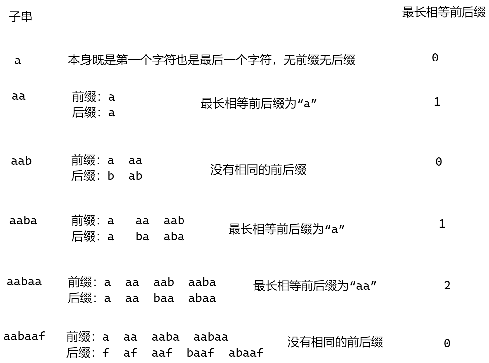
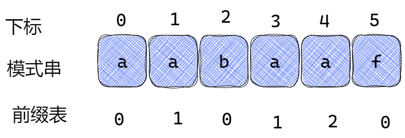
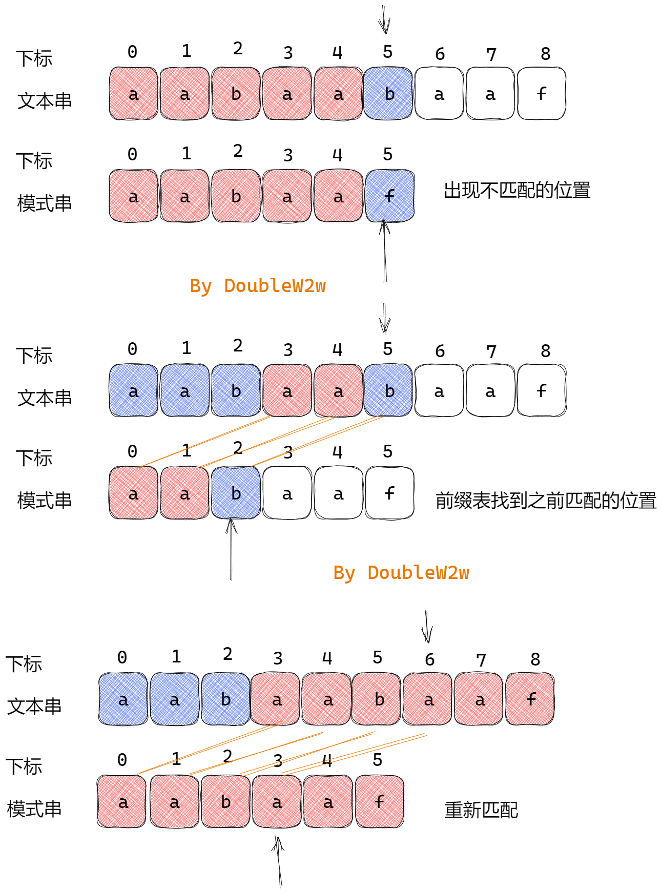
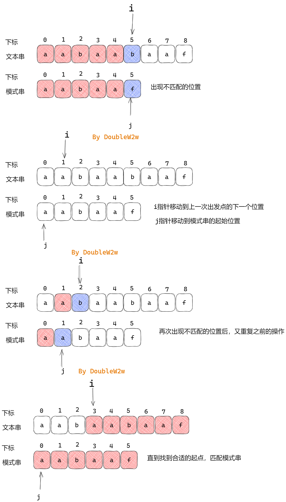
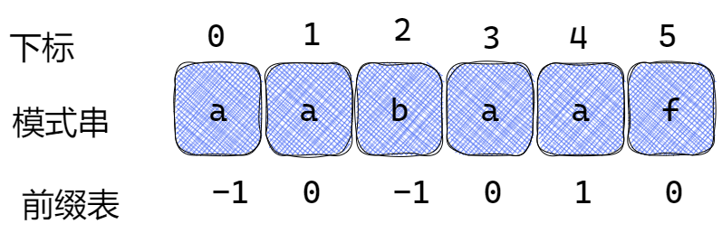

==**大部分内容来自：公众号代码随想录和Leetcode题解区的宫水三叶**==

## KMP算法的作用

​	KMP 算法是一个快速查找匹配串的算法，它的作用其实就是本题问题：**如何快速在「原字符串」中找到「匹配字符串」**，之所以能达到快速的效果是使用KMP算法时，**当出现字符串不匹配时，可以知道一部分之前已经匹配的文本内容，可以利用这些信息避免从头再去做匹配了**。

## 什么是前缀表、前缀、后缀

那么什么是前缀表：**记录下标 i 之前（包括i）的字符串中，有多大长度的相同前缀后缀。**

前缀：**不包含最后一个字符的所有以第一个字符开头的连续子串**

后缀：**不包含第一个字符的所有以最后一个字符结尾的连续子串**

## 为什么要使用前缀表

​	首先要知道前缀表的任务是当前位置匹配失败，找到之前已经匹配上的位置，再重新匹配。此也意味着在某个字符失配时，前缀表会告诉你下一步匹配中，模式串应该跳到哪个位置重新去匹配。

​	**前缀表是用来回退的，它记录了模式串与主串(文本串)不匹配的时候，模式串应该从哪里开始重新匹配。**

## 如何计算前缀表

文本串：aabaabaaf

模式串： aabaaf





​	==可以看出模式串与前缀表对应位置的数字表示的就是：**下标i之前（包括i）的字符串中，有多大长度的相同前缀后缀。**==

## 前缀表如何去匹配以及暴力解法

​	当找到不匹配的位置， 那么此时我们要看它的前一个字符的前缀表的数值是多少。

​	为什么要前一个字符的前缀表的数值呢，因为要找前面字符串的最长相同的前缀和后缀。前一个字符的前缀表的数值是2， 所有把下标移动到下标2的位置继续比配。**下标5之前这部分的字符串（也就是字符串aabaa）的最长相等的前缀 和 后缀字符串是 子字符串aa ，因为找到了最长相等的前缀和后缀，匹配失败的位置是后缀子串的后面，那么我们找到与其相同的前缀的后面从新匹配就可以了。**




- 暴力解法的匹配



- **KMP 利用已匹配部分中相同的「前缀」和「后缀」来加速下一次的匹配。**
- **KMP 的文本串指针不会进行回溯（没有暴力解法中回到下一个「发起点」的过程）。**
  - 随着匹配过程的进行，原串指针的不断右移，我们本质上是在不断地在否决一些「不可能」的方案。否决某些匹配出发点的子集方案。

## 前缀表与next数组

​	next数组即可以就是前缀表，也可以是前缀表统一减一

​	**next数组里面的元素表示的是该下标应该跳转到目标位置（next点）**



## 时间复杂度分析

​	其中 n 为文本串长度，m 为模式串长度，因为在匹配的过程中，根据前缀表不断调整匹配的位置，可以看出匹配的过程是$O(n)$，生成 next 数组，时间复杂度是 $O(m)$。所以整个KMP算法的时间复杂度是 $O(n+m)$ 的

## 构造next数组

**构造next数组其实就是计算模式串s，前缀表的过程。** 主要有如下三步：

1. 初始化
2. 处理前后缀不相同的情况
3. 处理前后缀相同的情况

**前缀表要统一减一的操作仅仅是一种实现**

1.初始化

因为我们知道前缀表第一个元素为-1，next[i] 表示 下标i（包括下标i）之前最长相等的前后缀长度（其实就是j）

```java
int j = -1;
next[0] = j;
```

2.处理前后缀不相同的情况

因为 j 初始化为-1，那么i就从1开始，进行s[ i ] 与 s[ j + 1]的比较，前后缀不相同就要向前回退。

那么 s[ i ] 与 s[ j + 1] 不相同，就要找 下标 j+1 的前一个元素在 next 数组里的值（就是next[ j ]）

```java
for(int i = 1; i < s.size(); i++) {
    while (j >= 0 && s[i] != s[j + 1]) { // 前后缀不相同了
    j = next[j]; // 向前回退
}
```

3.处理前后缀相同的情况

如果s[ i ] 与 s[j + 1] 相同，那么就同时向后移动 i 和 j。说明找到了相同的前后缀，同时还要将j（前缀的长度）赋给 next[ i ], 因为 next[ i ]要记录相同前后缀的长度

```java
if (s[i] == s[j + 1]) { // 找到相同的前后缀
    j++;
}
next[i] = j;
```


最后

```java
//统一减一的构建next数组版本
public void getNext(int[] next,  String s){
    int j = -1;
    next[0] = j;
    for(int i = 1; i < s.size(); i++) { // 注意i从1开始
        while (j >= 0 && s[i] != s[j + 1]) { // 前后缀不相同了
            j = next[j]; // 向前回退，会导致下标j+1往前回退，同时前缀表的值有可能是前一个字符的最长相等前后缀的值。
        }
        if (s[i] == s[j + 1]) { // 找到相同的前后缀
            j++;
        }
        next[i] = j; // 将j（前缀的长度）赋给next[i]
    }
}
```


```java
//不减一的构建next数组版本
public void getNext(int[] next, String s) {
    int j = 0;
    next[0] = 0;
    for(int i = 1; i < s.size(); i++) {
        while (j > 0 && s[i] != s[j]) { // j要保证大于0，因为下面有取j-1作为数组下标的操作
            j = next[j - 1]; // 注意这里，是要找前一位的对应的回退位置了
        }
        if (s[i] == s[j]) {
            j++;
        }
        next[i] = j;
    }
}
```


## 使用next数组来做匹配

```java
//前缀表统一减一的匹配版本
int j = -1; // 因为next数组里记录的起始位置为-1
for (int i = 0; i < s.size(); i++) { // 注意i就从0开始
    while(j >= 0 && s[i] != t[j + 1]) { // 不匹配
        j = next[j]; // 找到的不匹配的位置， 那么此时我们要看它的前一个字符的前缀表的数值是多少。找到上一次可以匹配的信息。
    }
    if (s[i] == t[j + 1]) { // 匹配，j和i同时向后移动
        j++; // i的增加在for循环里
    }
    if (j == (t.size() - 1) ) { // 文本串s里出现了模式串t
        return (i - t.size() + 1);
    }
}
```

```java
//前缀表统一不减一的匹配版本
for(int i = 1, j = 0; i < s.size() ; i++){
    while(j > 0 && s[i] != t[j]){
        j = next[ j - 1]; // 找到的不匹配的位置， 那么此时我们要看它的前一个字符的前缀表的数值是多少。找到上一次可以匹配的信息。
    }
    if(s[i] == t[j]){ // 匹配，j和i同时向后移动
        j++;  // i的增加在for循环里
    }
    if(j == t.size()){ // 文本串s里出现了模式串t
        return i - t.size() + 1;
    }
}
```


## 题目地址(28. 实现 strStr())

https://leetcode-cn.com/problems/implement-strstr/

### 题目描述

```
实现 strStr() 函数。

给你两个字符串 haystack 和 needle ，请你在 haystack 字符串中找出 needle 字符串出现的第一个位置（下标从 0 开始）。如果不存在，则返回  -1 。

 

说明：

当 needle 是空字符串时，我们应当返回什么值呢？这是一个在面试中很好的问题。

对于本题而言，当 needle 是空字符串时我们应当返回 0 。这与 C 语言的 strstr() 以及 Java 的 indexOf() 定义相符。

 

示例 1：

输入：haystack = "hello", needle = "ll"
输出：2


示例 2：

输入：haystack = "aaaaa", needle = "bba"
输出：-1


示例 3：

输入：haystack = "", needle = ""
输出：0


 

提示：

0 <= haystack.length, needle.length <= 5 * 104
haystack 和 needle 仅由小写英文字符组成
```

### 思路

KMP算法

### 代码

- 语言支持：Java

Java Code:

```java

class Solution {
    /*
    haystack:文本串
    needle:匹配串
    */
    public int strStr(String haystack, String needle) {
        if(needle.isEmpty()) return 0;
        //n为文本串的长度，m为匹配串长度
        int n = haystack.length(), m = needle.length();

        // 构建 next 数组，数组长度为匹配串的长度（next 数组是和匹配串相关的）
        int[] next = new int[m];
        next[0] = 0;  //next数组第一个位置初始化为0
        for (int i = 1, j = 0; i < m; i++) {
            // 前后缀不相同就要向前回退
            while(j > 0 && needle.charAt(i) != needle.charAt(j)){
                j = next[j - 1];
            }
            // 前后缀相同，i和j同时向后移动
            if(needle.charAt(i) == needle.charAt(j)){
                j++;
            }
            // 更新 next[i]，结束本次循环，i++
            next[i] = j;
        }

        // 匹配过程，i = 0，j = 0 开始
        for (int i = 0, j = 0; i < n; i++) {
            // 匹配不成功 j = next(j),跳转到匹配串的下一个出发点
            while(j > 0 && haystack.charAt(i) != needle.charAt(j)){
                j = next[j - 1];
            }
            // 匹配成功的话，先让 j++，结束本次循环后 i++
            if(haystack.charAt(i) == needle.charAt(j)){
                j++;
            }
            // 整一段匹配成功，直接返回下标
            if(j == m){
                return (i - m + 1);
            }
        }
        return -1;
    }
}


```

```java
//前缀表统一减一
class Solution {
    /*
    haystack:文本串
    needle:匹配串
    */
    public int strStr(String haystack, String needle) {
        if(needle.isEmpty()) return 0;
        //n为文本串的长度，m为匹配串长度
        int n = haystack.length(), m = needle.length();

        // 构建 next 数组，数组长度为匹配串的长度（next 数组是和匹配串相关的）
        int[] next = new int[m];
        next[0] = -1;
        for (int i = 1, j = -1; i < m; i++) {
            // 前后缀不相同就要向前回退
            while(j >= 0 && needle.charAt(i) != needle.charAt(j+1)){
                j = next[j];
            }
            // 前后缀相同，i和j同时向后移动
            if(needle.charAt(i) == needle.charAt(j+1)){
                j++;
            }
            // 更新 next[i]，结束本次循环，i++
            next[i] = j;
        }

        // 匹配过程，i = 0，j = 0 开始
        for (int i = 0, j = -1; i < n; i++) {
            // 匹配不成功 j = next(j),跳转到匹配串的下一个出发点
            while(j >= 0 && haystack.charAt(i) != needle.charAt(j+1)){
                j = next[j];
            }
            // 匹配成功的话，先让 j++，结束本次循环后 i++
            if(haystack.charAt(i) == needle.charAt(j+1)){
                j++;
            }
            // 整一段匹配成功，直接返回下标
            if(j == m - 1){
                return (i - m + 1);
            }
        }
        return -1;
    }
}

```

**复杂度分析**

令 n 为数组长度。

- 时间复杂度：$O(n+m)$，其中 n** 是字符串 haystack 的长度，m 是字符串 needle 的长度。我们至多需要遍历两字符串一次。
- 空间复杂度：$O()$，其中 m是字符串 needle 的长度。我们只需要保存字符串 needle 的前缀函数


